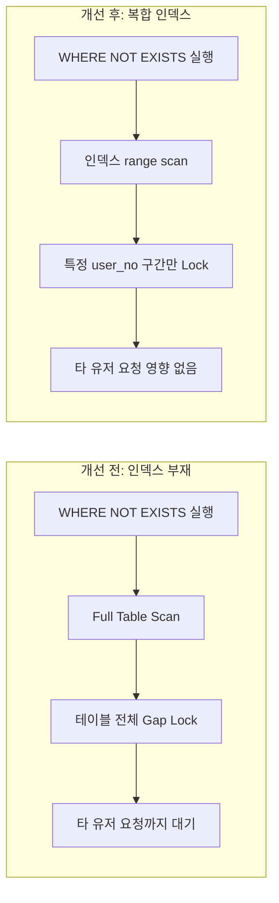

"사용자당 진행 중 세션은 하나만"이라는 규칙을 지키려면, 삽입 전에 반드시 기존 데이터의 존재 여부를 확인해야 합니다. 이 확인을 애플리케이션 레벨의 조회-후-삽입(Check-then-Act)으로 처리하면 Race Condition이 생기고, DB 레벨의 원자적 쿼리로 처리하면 그 쿼리가 어떤 락을 얼마나 넓게 거는지가 새로운 변수가 됩니다. 이번 사례는 후자를 선택한 뒤 마주친 문제였습니다.

> 인덱스 하나 추가한다고 "느린 쿼리를 빠르게" 만든 게 아니었습니다. 그 인덱스가 실제로 바꾼 건 락이 걸리는 범위였습니다.

## 원자적 쿼리로 Race Condition은 잡았는데

세션 생성 로직은 원래 "조회 후 없으면 삽입"하는 흔한 구조였습니다.

```java
Integer ongoingStatusNo = gameMapper.selectOngoingStudyStatus(userNo, ...);
if (ongoingStatusNo != null) return ongoingStatusNo;
gameMapper.insertStudyStatus(status);
```

사용자가 버튼을 연타하면 두 요청이 조회 구간을 동시에 통과해 세션이 중복 생성되는 Race Condition이 있었고, 이를 막기 위해 조건 검사와 삽입을 하나의 원자적 쿼리로 합쳤습니다.

```sql
INSERT INTO chatbot_study_status (user_no, level_title_no, game_type, quiz_type, status)
SELECT #{userNo}, #{levelTitleNo}, #{gameType}, #{quizType}, 1
FROM DUAL
WHERE NOT EXISTS (
    SELECT 1 FROM chatbot_study_status
    WHERE user_no = #{userNo} AND status = 1 ...
);
```

쿼리 하나로 중복은 확실히 막혔습니다. 문제는 이 쿼리를 부하 상황에 올리면서 시작됐습니다.

## 왜 락이 테이블 전체로 번졌나

### Full Table Scan이 만든 락 확산

`WHERE NOT EXISTS`의 서브쿼리가 참조하는 컬럼에는 인덱스가 없었습니다. DB 엔진은 중복 여부를 판별하기 위해 테이블 전체를 훑는 Full Table Scan을 선택했고, `REPEATABLE READ` 격리 수준에서 인덱스 없는 스캔은 스캔 경로에 놓인 모든 레코드와 그 사이 간격(Gap)에 Next-Key Lock을 겁니다.

결과적으로 A 유저의 중복 가입을 막으려던 쿼리가 A 유저와 아무 상관 없는 다른 유저들의 삽입 요청까지 막아버렸습니다. 부하 테스트에서는 특정 유저 하나의 조건 검사가 테이블 전체의 쓰기 처리량을 마비시키는 형태로 나타났고, 관련 없는 유저의 요청이 큐잉 지연을 겪다 연결이 거절되는 현상까지 이어졌습니다.

### "느리다"가 아니라 "범위가 넓다"는 문제

여기서 확인해야 했던 건 "왜 느린가"가 아니라 "이 쿼리가 락을 거는 범위가 어디까지인가"였습니다. 인덱스 부재는 단순한 조회 성능 문제가 아니라 락 범위 문제로 이어졌습니다. 인덱스가 없는 조건절은 DB 엔진 입장에서 "어디까지가 안전한 범위인지" 판단할 근거가 없기 때문에, 가장 보수적인 선택인 "전체를 잠근다"로 귀결됩니다.

## 세 가지 방법, 그리고 남은 절반의 문제

락 범위를 줄이기 위한 세 가지 방법을 비교했습니다.

1. **Redis 분산 락**
   - 장점: 락 제어를 DB 밖으로 빼면 DB 엔진의 락 승격 규칙과 완전히 독립적으로 동시성을 제어할 수 있습니다.
   - 단점: 단일 DB로 운영되는 현재 인프라에 새 저장소와 모니터링 체계를 얹는 비용이 이 문제 하나를 풀기엔 과했습니다. 기각했습니다.
2. **일반 복합 유니크 인덱스**
   - 장점: 중복 자체를 스키마 레벨에서 강력하게 막아줍니다.
   - 단점: "완료된 세션은 무한히 쌓이고 진행 중 세션만 하나여야 한다"는 요구사항과 맞지 않았습니다. 일반 유니크 인덱스를 걸면 완료 이력이 계속 쌓여야 하는 컬럼 조합에서도 중복이 차단돼, 유저가 같은 레벨을 재학습한 이력을 저장할 수 없게 됩니다. 채택하지 않았습니다.
3. **선택도 기반 복합 인덱스 (채택)**
   - 장점: 조회 조건을 그대로 인덱스로 반영하면서 데이터 모델을 바꾸지 않아도 됩니다. 별도 인프라도 필요 없습니다.
   - 단점: 인덱스 자체가 조건부 유일성(진행 중 세션만 하나)까지 보장해주지는 않으므로, 이 부분은 별도로 처리해야 합니다.

`WHERE NOT EXISTS`가 참조하는 조건절 순서에 맞춰, 고유값 범위가 가장 넓은 `user_no`를 선두로 하는 복합 인덱스를 구성했습니다.

```sql
CREATE INDEX idx_study_session_check
ON chatbot_study_status (user_no, level_title_no, game_type, quiz_type, status);
```

이 인덱스를 추가한 뒤 실행 계획이 전체 스캔(`ALL`)에서 인덱스 범위 스캔(`ref`)으로 바뀌었고, 락이 걸리는 범위도 테이블 전체에서 특정 `user_no` 근처의 좁은 구간으로 줄었습니다. 다른 유저의 요청이 A 유저의 요청 때문에 대기하는 현상이 사라졌습니다.



## 결과 및 회고

30만 건의 이력 데이터를 적재한 상태에서 k6 500 VUs 부하 테스트로 측정한 결과입니다.

| 구분 | 지표 | 개선 전 (인덱스 부재) | 개선 후 (복합 인덱스) |
| --- | --- | --- | --- |
| 속도 | p95 응답 지연 | 8.86s | 1.45s |
| 처리량 | TPS | 37.65 req/s | 197.35 req/s |

1. **인덱스 추가는 보통 "느린 쿼리를 빠르게 만드는" 조회 최적화로 취급되지만, 이번 사례에서 인덱스가 실제로 바꾼 건 응답 속도 이전에 락이 걸리는 범위였습니다.** 인덱스 설계는 트랜잭션끼리 충돌하는 경계를 어디까지 좁힐 것인가를 정하는 작업이라는 걸 체감했습니다.
2. **락 범위를 좁혔다고 동시성 문제 전체가 해결된 건 아니었습니다.** 같은 유저의 요청끼리는 여전히 같은 인덱스 구간을 겨냥하기 때문에, 이 인덱스만으로는 풀리지 않는 문제가 남아있었고 그건 별도로 다뤄야 했습니다.
